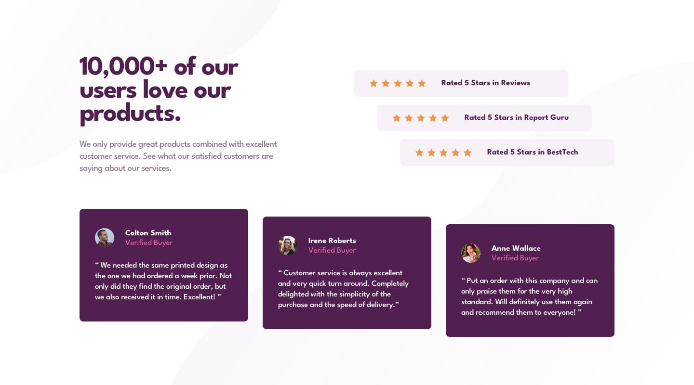

# [Frontend Mentor - Social Proof Section Challenge](https://www.frontendmentor.io/challenges/social-proof-section-6e0qTv_bA)

- ## [Deployed on Vercel](https://fm-social-proof-section-mu.vercel.app/)
- ## [GitHub Repository](https://github.com/panosjapan7/fm-social-proof-section)
- ## [My Frontend Mentor Profile](https://www.frontendmentor.io/profile/panosjapan7)
** **
- ### Built with
    - Semantic HTML5 markup
    - CSS
    - Flexbox
    - Mobile-first workflow

